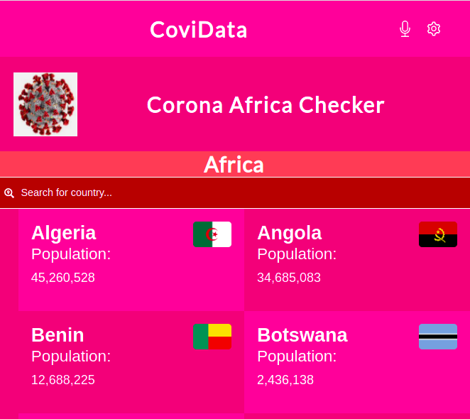

# Metrics WebApp

> This is a mobile web application that displays a list of metrics generated from the [Narrativa API](https://covid19tracking.narrativa.com/index_en.html). This API provides data on COVID-19.

## Live demo
- [Heroku](https://react-redux-metrics-app.herokuapp.com/)
- [Netlify](https://tender-jepsen-8056f0.netlify.app/)

## Milestones completed:
- Create a new React App using CRA.
- Install app dependencies.
- Build file structure for app.
- Create routes and navigation in app.
- Display list of items gotten from [Narrativa API](https://covid19tracking.narrativa.com/index_en.html).
- Writes unit tests for pure functions.
- Create integration tests using React Testing Library.
- Style components to match design on [behance](https://www.behance.net/gallery/31579789/Ballhead-App-(Free-PSDs)).
- To get started with CRA, see more information below:

#### Getting Started with Create React App

This project was bootstrapped with [Create React App](https://github.com/facebook/create-react-app).

#### Available Scripts

In the project directory, you can run:

#### `npm start`

Runs the app in the development mode.\
Open [http://localhost:3000](http://localhost:3000) to view it in the browser.

The page will reload if you make edits.\
You will also see any lint errors in the console.

#### `npm test`

Launches the test runner in the interactive watch mode.\
See the section about [running tests](https://facebook.github.io/create-react-app/docs/running-tests) for more information.

#### `npm run build`

Builds the app for production to the `build` folder.\
It correctly bundles React in production mode and optimizes the build for the best performance.

The build is minified and the filenames include the hashes.\
Your app is ready to be deployed!

See the section about [deployment](https://facebook.github.io/create-react-app/docs/deployment) for more information.

### Learn More

You can learn more in the [Create React App documentation](https://facebook.github.io/create-react-app/docs/getting-started).

To learn React, check out the [React documentation](https://reactjs.org/).

## Built With
- React, React Router, Redux, Redux Logger, Webpack, Behance, Javascript, React testing library, Babel and Jest

## Getting Started
To get a local copy up and running follow these simple example steps.
- git clone https://github.com/AyoubMS/microverse-react-redux-capstone

### Setup
- git clone https://github.com/AyoubMS/microverse-react-redux-capstone
- cd ./microverse-react-redux-capstone

### Install
- npm install

### Usage
- npm start

### Run tests
- npm run test
- npm run jest

If you are non a technical person you can download the zip file.

- To do that you have to go to the green button that says 'Code' and then press on it.
- Choose the option 'Download Zip' and wait until it download.
- Then you need to decompress it.
- You will need to have Zip compress file software installed in your computer. If you don't have it you can download it from here
  [`https://www.7-zip.org/download.html`](https://www.7-zip.org/download.html)
- Do double click on the bookstore.zip and choose a folder where to place all the decompressed files.
- Once you are done decompressing, you can open the created folder.
- In it you can double click on the index.html file and choose a browser to open it (For example google Chrome Browser).
- Now you should be able to see the project.
- Remember to use the mouse to navigate through the website. Also you can use the keys 'arrow up' and 'arrow down' of your keyboard to scroll up and down.

## Author
👤 **Ayoub Chahir**

- GitHub: [@AyoubMS](https://github.com/AyoubMS)
- Twitter: [@ChahirDev](https://twitter.com/ChahirDev)
- LinkedIn: [Ayoub Chahir](https://www.linkedin.com/in/ayoub-chahir/)

## 🤝 Contributing

Contributions, issues, and feature requests are welcome!

Feel free to check the [issues page](../../issues/).

## Show your support

Give a ⭐️ if you like this project!

## 📝 License

This project is [MIT](./MIT.md) licensed.

## Acknowledgments
- Nelson Sakwa on Behance for the design guideline.
- Microverse for the project inspiration.

## Live Presentation Video
[Link] (https://www.loom.com/share/216db4843366423b9c925d98df9c9098)